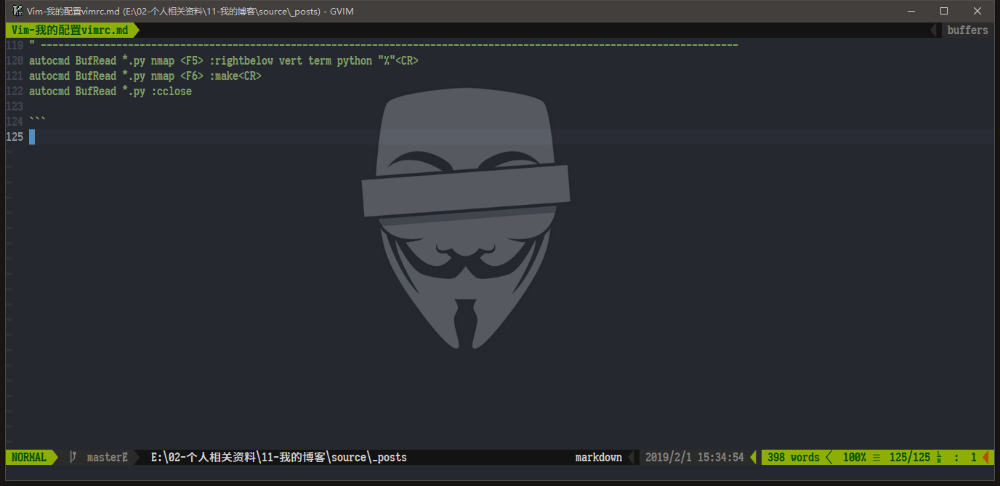

# 配置文件
```bash

" ============================================================
" || 判断操作系统是 Windows 还是 Linux 和判断是终端还是 Gvim ||
" ============================================================

" ============================================================
" | 判断操作系统是否是 Windows 还是 Linux |
" ============================================================
let g:iswindows = 0
let g:islinux = 0
if(has("win32") || has("win64") || has("win95") || has("win16"))
    let g:iswindows = 1
else
    let g:islinux = 1
endif
" ============================================================
" | 判断是终端还是 Gvim |
" ============================================================
if has("gui_running")
    let g:isGUI = 1
else
    let g:isGUI = 0
endif
" ============================================================
 
 

" ============================================================
" || 以下为用户自定义配置 包括不限于插件,编码等配置 ||
" ============================================================

" ============================================================
" | Vim - Plug 插件管理工具配置 |
" ============================================================
" 判断是否为Linux如果是就把插件储存到自定义目录,否则储存到Windwos自定义目录
if g:islinux
call plug#begin('~/.vim/plugged')
else
call plug#begin('$VIMRUNTIME\plugged')                                   " 自定义插件文件夹
endif
Plug 'joshdick/onedark.vim'                                              " 主题文件
Plug 'vim-airline/vim-airline'                                           " 状态栏
Plug 'vim-airline/vim-airline-themes'                                    " 状态栏主题
Plug 'tpope/vim-fugitive'                                                " git插件
Plug 'scrooloose/nerdtree'                                               " 文件树插件
Plug 'godlygeek/tabular'                                                 " 文本对齐插件
Plug 'iamcco/markdown-preview.nvim',{'do': {->mkdp#util#install()}}      " markdown预览
Plug 'dhruvasagar/vim-table-mode'                                        " 表格模式
Plug 'terryma/vim-multiple-cursors'                                      " 多光标插件
Plug 'majutsushi/tagbar'                                                 " Tag浏览
Plug 'junegunn/goyo.vim'                                                 " 文字居中显示插件
Plug 'schmich/vim-guifont'                                               " 字体增大减小插件
"Plug 'scrooloose/nerdcommenter'                                         " 快速注释插件    
"Plug 'jiangmiao/auto-pairs'
"Plug 'tpope/vim-surround'
"Plug 'itchyny/lightline.vim'
call plug#end()
" ============================================================


" ============================================================
" | 编码配置 |
" ============================================================
" 注：使用utf-8格式后，软件与程序源码、文件路径不能有中文，否则报错
set encoding=utf-8                                                       " 设置gvim内部编码，默认不更改
set fileencoding=utf-8                                                   " 设置当前文件编码，可以更改
set fileencodings=ucs-bom,utf-8,gbk,cp936,latin-1                        " 设置支持打开的文件的编码
 
" 文件格式，默认 ffs=dos,unix
set fileformat=unix                                                      " 设置新（当前）文件的<EOL>
set fileformats=unix,dos,mac                                             " 给出文件的<EOL>格式类型
 
if (g:iswindows && g:isGUI)
" 解决菜单乱码
    source $VIMRUNTIME/delmenu.vim
    source $VIMRUNTIME/menu.vim

" 解决consle输出乱码
    language messages zh_CN.utf-8
endif


" ============================================================
" | 界面配置 |
" ============================================================
set number                                                               " 显示行号
set laststatus=2                                                         " 启用状态栏信息
set cmdheight=1                                                          " 设置命令行的高度为2，默认为1
set cursorline                                                           " 突出显示当前行
set clipboard=unnamed                                                    " 共享剪贴板 
set nowrap                                                               " 设置不自动换行
set showtabline=2                                                        " 永远显示标签页
set guioptions=M                                                         " 去除VIN得GUI版本中得菜单栏
set guioptions=T                                                         " 去除VIN得GUI版本中得工具栏
set t_Co=256                                                             " 设置终端显示颜色
set scrolloff=5                                                          " 光标上下两侧最少保留屏幕行数
syntax enable                                                            " 开启语法高亮
" set shortmess=atI                                                      " 去掉欢迎界面
if has('gui_win32')
set guifont=Inziu_Iosevka_Slab_SC:b:h12:cANSI                            " 设置字体:字号
else
set guifont=DejaVu\ Sans\ Mono\ 10
endif

" ============================================================
" | 设置 gVim 窗口初始位置及大小 |
" ============================================================
if g:isGUI
" au GUIEnter * simalt ~x                                                " 窗口启动时自动最大化
    winpos 380 240                                                       " 指定窗口出现的位置
    set lines=30 columns=170                                             " 指定窗口大小
endif


" ============================================================
" | 设置代码配色方案 |
" ============================================================
if g:isGUI
    colorscheme onedark                                                  " Gvim配色方案
else
    colorscheme onedark                                                  " 终端配色方案
endif


" ============================================================
" | 显示/隐藏菜单栏、工具栏、滚动条，可用 F2 切换 |
" ============================================================
set guioptions-=m
set guioptions-=T
map <silent> <F2> :if &guioptions =~# 'T' <Bar>
        \set guioptions-=T <Bar>
        \set guioptions-=m <bar>
    \else <Bar>
        \set guioptions+=T <Bar>
        \set guioptions+=m <Bar>
    \endif<CR>
    
    
" ============================================================
" | 判断如果是终端模式 自动转换256真色彩 |
" ============================================================
if g:islinux==0
  set termguicolors
endif


" ============================================================
" | 启用每行超过80列的字符提示（字体变蓝并加下划线），不启用就注释掉 |
" ============================================================
" au BufWinEnter * let w:m2=matchadd('Underlined', '\%>' . 80 . 'v.\+', -1)


" ============================================================
" | 编写文件时的配置 |
" ============================================================
filetype on                                                              " 启用文件类型侦测
filetype plugin on                                                       " 不同的文件类型加载对应的插件
filetype plugin indent on                                                " 启用缩进
set autoindent                                                           " 代码自动对齐
set smartindent                                                          " 启用智能对齐方式
set expandtab                                                            " 将Tab键转换为空格
set tabstop=4                                                            " 设置Tab键的宽度
set shiftwidth=4                                                         " 换行时自动缩进宽度
set smarttab                                                             " 指定按一次backspace就删除
set ambiwidth=double                                                     " 设置为双字宽显示
set helplang=cn                                                          " 双字宽
set showmatch                                                            " 匹配模式,括号匹配
set nocompatible                                                         " 去掉有关vi一致性模式
set backspace=indent,eol,start                                           " 设置退格键的工作方式
set hlsearch                                                             " 高亮搜索的关键字
set paste                                                                " 设置粘贴模式
set pythonthreedll=python36.dll                                          " python3.6支持
set foldmethod=marker                                                    " marker 折叠方式
" set foldmarker={,}                                                     " 折叠字符串设定
" set foldenable                                                         " 启用折叠
" set foldmethod=indent                                                  " indent 折叠方式


" ============================================================
" | 其它配置 |
" ============================================================
set writebackup                                                          " 保存文件前建立备份成功后删除
set nobackup                                                             " 设置无备份文件
set undofile                                                             " 开启撤销功能
set undodir=$HOME/                                                       " 开启撤销功能的目录
set autoread                                                             " 文件在外部被修改自动更新
set ignorecase                                                           " 搜索模式里忽略大小写
" set noswapfile                                                         " 设置无临时文件
" set vb t_vb=                                                           " 关闭提示音
" set noincsearch                                                        " 在输入要搜索的文字时，取消实时匹配


 
" ============================================================
" || 快捷键及VIM功能按键配置 ||
" ============================================================
" | 编辑模式下移动光标 |
" ============================================================
" Ctrl + K 插入模式下光标向上移动
" imap <c-k> <Up>
" Ctrl + J 插入模式下光标向下移动
" imap <c-j> <Down>
" Ctrl + H 插入模式下光标向左移动
" imap <c-h> <Left>
" Ctrl + L 插入模式下光标向右移动
" imap <c-l> <Right>

" ============================================================
" | 设置NERDTree快捷键配置      |
" | 常规模式下输入 F12 插件开关 |
" ============================================================
map <F12> :NERDTreeMirror<CR>
map <F12> :NERDTreeToggle<CR>


" ============================================================
" | Markdown-Preview 插件配置         |
" | F9 开启预览 F10 切换开启/关闭服务 |
" ============================================================
" nmap <silent> <F9> <Plug>MarkdownPreview                                
nmap <silent> <F10> <Plug>MarkdownPreviewToggle      


" ============================================================
" | Tagbar 插件配置        |
" | F8 开启右侧边栏预览Tag |
" ============================================================
nmap <F8> :TagbarToggle<CR>


" ============================================================
" | 外部插件调整透明度及置顶模式 |
" ============================================================
" 映射 Alt+Enter 切换全屏vim
map <S-enter> <esc>:call ToggleFullScreen()<cr>
" 切换Vim是否在最前面显示
nmap <A-0> <esc>:call SwitchVimTopMostMode()<cr>
" 增加Vim窗体的不透明度
nmap <A-=> <esc>:call SetAlpha(10)<cr>
" 增加Vim窗体的透明度
nmap <A--> <esc>:call SetAlpha(-10)<cr>
" 默认设置透明
autocmd GUIEnter * call libcallnr(g:MyVimLib, 'SetAlpha', g:VimAlpha)


" ============================================================
" | 设置退出term模式快捷键ALT+Q |
" ============================================================
tnoremap <m-q> <c-\><c-n>									


" ============================================================
" | 配置Ctrl+c v x 方式 |
" ============================================================
" CTRL-X and SHIFT-Del are Cut
vnoremap <C-X> "+x
vnoremap <S-Del> "+x
" CTRL-C and CTRL-Insert are Copy
vnoremap <C-C> "+y
vnoremap <C-Insert> "+y
" CTRL-V and SHIFT-Insert are Paste
map <C-V> "+gP
map <S-Insert> "+gP
map! <C-V> <C-R>+
map! <S-Insert> <C-R>+


" ============================================================
" | 切换窗口快捷键设置 Alt + hjkl |
" ============================================================
noremap <m-h> <c-w>h
noremap <m-l> <c-w>l
noremap <m-j> <c-w>j
noremap <m-k> <c-w>k
map! <m-h> <esc><c-w>h
map! <m-l> <esc><c-w>l
map! <m-j> <esc><c-w>j
map! <m-k> <esc><c-w>k


" ============================================================
" | 调整窗口位置快捷键设置 F3 |
" ============================================================
nmap <F3> :simalt ~m<CR>


" ============================================================
" | 功能键配置 |
" ============================================================
" | 常规模式下输入 cS 清除行尾空格 |
" ============================================================
nmap cS :%s/\s\+$//g<CR>:noh<CR>
" 常规模式下输入 cM 清除行尾 ^M 符号
nmap cM :%s/\r$//g<CR>:noh<CR>


" ============================================================ 
" | 常规模式下用空格键来开关光标行所在折叠（注：zR 展开所有折叠，zM 关闭所有折叠）|
" ============================================================ 
nnoremap <space> @=((foldclosed(line('.')) < 0) ? 'zc' : 'zo')<CR>


" ============================================================ 
" | 设置切换Buffer功能键 |
" ============================================================ 
nnoremap <C-N> :bn<CR>                                                   
nnoremap <C-P> :bp<CR>       


" ============================================================
" || 语言调试配置 ||
" ============================================================
" | Python相关 |
" ============================================================
" 窗口位置参数可选 leftabove aboveleft rightbelow belowright topleft botright 
" 分割位置参数 vert splitbelow
" autocmd BufRead *.py nmap <F5> :rightbelow vert term python "%"<CR> 
autocmd BufRead *.py nmap <F5> :botright term python "%"<CR> 
autocmd BufRead *.py nmap <F6> :make<CR>
autocmd BufRead *.py :cclose 


" ============================================================
" || 以下为常用插件配置 ||
" ============================================================
" | Airline.vim 插件配置 |
" ============================================================
" 用于美化状态栏
let g:airline_theme='powerlineish'                                       " 设置状态栏主题
let g:airline#extensions#tabline#enabled= 1                              " 开启tabline
let g:airline#extensions#tabline#show_tabs = 0                           " 显示Tabls文字
let g:airline#extensions#tabline#buffer_nr_show = 1                      " tabline中buffer显示编号
let g:airline#extensions#tabline#fnamemod = ':t'                         " 只显示文件名称
let g:airline_section_y = '%{strftime("%c")}'                            " 显示时间
let g:airline_section_c = '%{getcwd()}'                                  " 显示文件路径+ \%f文件名
let g:airline_powerline_fonts= 1                                         " 使用powerline打过补丁的字体
let g:airline#extensions#whitespace#enabled = 0                          " 取消计数


" ============================================================
" | NERDTree 插件配置 |
" ============================================================
" 目录树形结构的文件浏览插件
let NERDTreeShowBookmarks=1                                              " 显示书签
let NERDTreeChDirMode=2                                                  " 是否改变PWD目录路径
let NERDTreeQuitOnOpen=1                                                 " 打开后是否关闭NT窗口
let NERDTreeMinimalUI=1                                                  " 不显示帮助面板
let NERDTreeWinSize=50                                                   " 窗口宽度
let g:NERDTreeHidden=0                                                   " 是否显示隐藏文件
let NERDTreeIgnore=['\.pyc','\~$','\.swp','_gsdata_']                    " 过滤所有指定的文件和文件夹
let g:NERDTreeShowLineNumbers=1                                          " 是否显示行号
let g:NERDTreeDirArrowExpandable = '▸'                                   " 设置树的显示图标
let g:NERDTreeDirArrowCollapsible = '▾'                                  " 设置树的显示图标
" let NERDTreeSortOrder=[1]                                              " 排序设置0 or 1
" ============================================================


" ============================================================
" | vim-table-mode 插件配置 |
" ============================================================
" 快速制作表格
" <Leader> = \
" <Leader>tm  table mode 开关
" <Leader>tdd 删除一行
" <Leader>tdc 删除一列
" <Leader>tt 使用定义的分隔符插入表格
" <Leader>T 使用用户输入的分隔符插入表格
" <Leader>tr 重新对齐
" <Leader>|| 插入表头边框
" let g:table_mode_border=0
" let g:table_mode_fillchar=' '
" let g:table_mode_delimiter = ' '                                       " 定义分隔符插入表格
let g:table_mode_corner = '|'


" ============================================================
" | kdown-Preview 插件配置 |
" ============================================================
" 编辑预览Markdown必备插件 
" F09开启预览 F10关闭预览
" 开启Chrome预览,需要提前在Windows环境下设置path
"let g:vim_markdown_folding_disabled = 0                                  " Markdown折叠控制
let g:mkdp_auto_close=1												      " 自动关闭
let g:mkdp_open_to_the_world=1                                            " 可以让局域网用户预览
let g:mkdp_open_ip = ''                                                   " 自定义IP地址预览
let g:mkdp_port = '8888'                                                  " 自定义监听端口
"let g:mkdp_markdown_css = 'D:\Vim\vim81\taotao.css'                      " 自定义CSS文件


" ============================================================
" | Tagbar 插件配置 |
" ============================================================
" 预览tab必备 
let g:tagbar_ctags_bin = '$VIMRUNTIME\ctags.exe'
" 添加支持Markdown文件的Tag预览
let g:tagbar_type_markdown = {
    \ 'ctagstype': 'markdown',
    \ 'ctagsbin' : '$VIMRUNTIME\markdown2ctags.py',
    \ 'ctagsargs' : '-f - --sort=yes --sro=»',
    \ 'kinds' : [
        \ 's:sections',
        \ 'i:images'
    \ ],
    \ 'sro' : '»',
    \ 'kind2scope' : {
        \ 's' : 'section',
    \ },
    \ 'sort': 0,
\ }


" ============================================================
" | Guifont++插件配置 |
" ============================================================
"让vim像IDE一样一键放大缩小字号
if has('gui_win32')
let guifontpp_size_increment=1                                            " 每次更改的字号
let guifontpp_smaller_font_map="<Leader>-"                                " 减小字号 
let guifontpp_larger_font_map="<Leader>="                                 " 增大字号 
let guifontpp_original_font_map="<Leader>0"                               " 还原字号
endif


" ============================================================
"  << 以下为常用工具配置 >>
" ============================================================
"  < gvimfullscreen 工具配置 > 请确保已安装了工具
" ============================================================
" 用于 Windows Gvim 全屏窗口，可用 F11 切换
" 全屏后再隐藏菜单栏、工具栏、滚动条效果更好
" Win平台下窗口全屏组件 gvimfullscreen.dll
" Shift + Enter 全屏切换
" Alt + - 降低窗口透明度
" Alt + = 加大窗口透明度
" Alt + 0 切换Vim是否总在最前面显示
" Vim启动的时候自动使用当前颜色的背景色以去除Vim的白色边框
if (g:iswindows && g:isGUI)
if has('gui_running') && has('gui_win32') && has('libcall')
    let g:MyVimLib = 'gvimfullscreen.dll'
    function! ToggleFullScreen()
        call libcall(g:MyVimLib, 'ToggleFullScreen', 1)
    endfunction

    let g:VimAlpha = 245
    function! SetAlpha(alpha)
        let g:VimAlpha = g:VimAlpha + a:alpha
        if g:VimAlpha < 80
            let g:VimAlpha = 80
        endif
        if g:VimAlpha > 255
            let g:VimAlpha = 255
        endif
        call libcall(g:MyVimLib, 'SetAlpha', g:VimAlpha)
    endfunction

    let g:VimTopMost = 0
    function! SwitchVimTopMostMode()
        if g:VimTopMost == 0
            let g:VimTopMost = 1
        else
            let g:VimTopMost = 0
        endif
        call libcall(g:MyVimLib, 'EnableTopMost', g:VimTopMost)
    endfunction
endif
endif


" ============================================================
" << 以下为常用自动命令配置 >>
" ============================================================
" 自动切换目录为当前编辑文件所在目录
au BufRead,BufNewFile,BufEnter * cd %:p:h
" ============================================================
 


" ============================================================
" << windows 下解决 Quickfix 乱码问题 >>
" ============================================================

" windows 默认编码为 cp936，而 Gvim(Vim) 内部编码为 utf-8，所以常常输出为乱码
" 以下代码可以将编码为 cp936 的输出信息转换为 utf-8 编码，以解决输出乱码问题
" 但好像只对输出信息全部为中文才有满意的效果，如果输出信息是中英混合的，那可能
" 不成功，会造成其中一种语言乱码，输出信息全部为英文的好像不会乱码
" 如果输出信息为乱码的可以试一下下面的代码，如果不行就还是给它注释掉
 
" if g:iswindows
"     function QfMakeConv()
"         let qflist = getqflist()
"         for i in qflist
"            let i.text = iconv(i.text, "cp936", "utf-8")
"         endfor
"         call setqflist(qflist)
"      endfunction
"      au QuickfixCmdPost make call QfMakeConv()
" endif


```

# 插件下载及配置

## 全屏插件


<br>
将这个 dll 文件扔到 gvim.exe 所在的目录（也就是安装目录）.

然后通过 gVim 内置的命令调用这个 dll 中的接口，就可以达到窗口最大化了

```
map <F11> <Esc>:call libcallnr("gvimfullscreen.dll", "ToggleFullScreen", 0)<CR>
```

----

## 透明插件


<br>
将这个 dll 文件扔到 gvim.exe 所在的目录（也就是安装目录）.

SetAlpha 数值越小,透明度越大

```
autocmd guienter * call libcallnr("vimtweak64","SetAlpha",255)
```

----

## 插件管理器


<br>
下载后放到Gvim安装目录下的 autoload 文件夹内 , 并在Vimrc内设置

以下的例子为plugged文件夹 , 没有的话请新建一个

```
call plug#begin('D:\Vim\vim81\plugged')      " 自定义插件文件夹
```

配置完毕后运行 `:PlugInstall` 安装插件

常用VimPlug插件命令如下:

|命令|解释|
|:--:|:--:|
|:PlugInstall |安装插件|
|:PlugClean   |卸载插件|
|:PlugUpdate  |升级插件|


